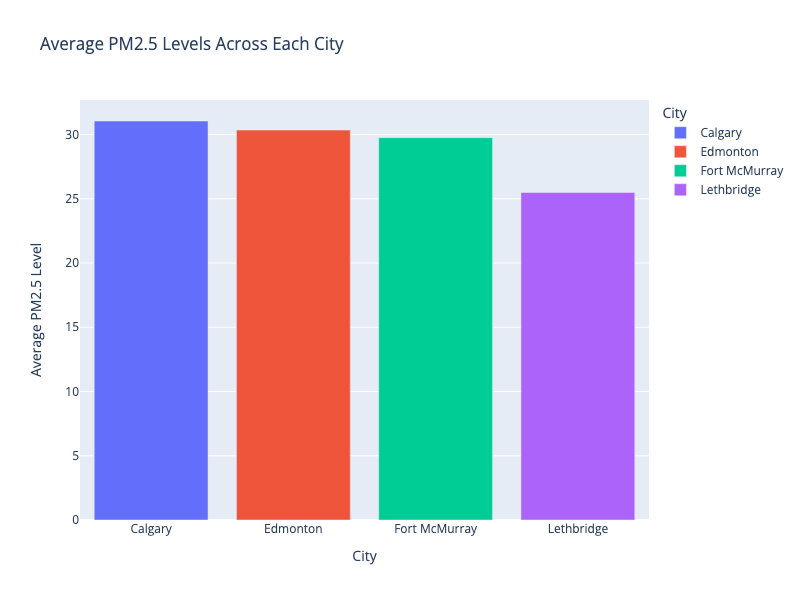

# PM2.5 Air Quality Analysis in Alberta (2014-2024)

**An in-depth analysis of Particulate Matter 2.5 (PM2.5) air quality trends across Alberta, examining public health implications and guiding future air quality management efforts.**

## Table of Contents

- [Structure of the Repository](#structure-of-the-repository)
- [Overview](#overview)
  - [Summary](#summary)
  - [Key Questions](#key-questions)
- [Key Insights and Findings](#key-insights-and-findings)
  - [How have the PM2.5 Levels changed since 2014 in each city?](#how-have-the-pm25-levels-changed-since-2014-in-each-city)
  - [What are the average PM2.5 levels across each city (monitoring station)?](#what-are-the-average-pm25-levels-across-each-city-monitoring-station)
  - [What is the frequency of PM2.5 levels detected in each city that are above the average?](#what-is-the-frequency-of-pm25-levels-detected-in-each-city-that-are-above-the-average)
  - [What months, and cities, tend to have above-average PM2.5 levels?](#what-months-and-cities-tend-to-have-above-average-pm25-levels)
  - [What periods in the year do above-average PM2.5 occur the most?](#what-periods-in-the-year-do-above-average-pm25-occur-the-most)
  - [What is the longest duration of above-average PM2.5 levels for each monitoring station?](#what-is-the-longest-duration-of-above-average-pm25-levels-for-each-monitoring-station)
- [Data & Methodology](#data--methodology)
  - [Data Source(s)](#data-sources)
  - [Structure of the Data](#structure-of-the-data)
  - [Methods Used](#methods-used)
- [Getting Started](#getting-started)
  - [Installation](#installation)
  - [Usage](#usage)
- [Results/Findings](#resultsfindings)
- [Limitations](#limitations)
- [License](#license)
- [Acknowledgments](#acknowledgments)

## Structure of the Repository

- `Data/`: Contains the PM2.5 datasets for the cleaning notebook, and the cleaned versions of the datasets for the analysis notebook, for each monitoring station

- `HTML Notebooks/`: Contains HTML versions of each Jupyter Notebook, with code blocks and outputs displayed. 

    - `aqi_cleaning_nb.html` - HTML version of Data Cleaning Notebook (in HTML).

    - `aqi_analysis_nb.html` - Dataset Analysis and Visualization Notebook (in HTML).

- `outputs`: Stores generated plots and figues from analysis (static images).

- `aqi_data_cleaning.ipynb`: Preprocesses the data.

- `aqi_analysis_nb.ipynb`: Visualizes the trends and findings.Ω

- `requirements.txt`: Lists all dependencies needed to run the notebooks.


## Overview

###  Summary

This report provides an in-depth analysis of Particulate Matter 2.5 (PM2.5) air quality trends in Alberta from 2014 to 2024. Utilizing data from four weather monitoring stations, it explores the implications of PM2.5 levels on public health and environmental integrity within the province's diverse landscapes.

### Key Questions

- How have the PM2.5 Levels changed since 2014 in each city?
- What are the average PM2.5 levels across each city (monitoring station)?
- What is the frequency of PM2.5 levels detected in each city that are above the average?
- What months, and cities, tend to have above average PM2.5 levels?
- What is the longest duration of above average PM2.5 levels for each monitoring station?
- What periods in the year do above average PM2.5 occur the most?

------

### Key Insights and Findings

#### How have the PM2.5 Levels changed since 2014 in each city?

- The PM2.5 levels have shown variability over time in each city. Notable spikes in PM2.5 levels correspond to specific events, like the wildfires near Fort McMurray in 2016. Since 2018, Edmonton and Fort McMurray have shown similar AQI readings, with occasional data collection gaps in Edmonton.

#### What are the average PM2.5 levels across each city (monitoring station)?

- Calgary and Edmonton have higher average PM2.5 levels compared to Fort McMurray and Lethbridge. This suggests urban traffic, industrial emissions, and geographical factors contribute to these differences.

#### What is the frequency of PM2.5 levels detected in each city that are above the average?

- Calgary experiences the highest frequency of days with above-average PM2.5 levels, followed by Lethbridge, Fort McMurray, and Edmonton. This ranking suggests that larger urban centers and their activities might be significant contributors to elevated PM2.5 levels.

#### What months, and cities, tend to have above-average PM2.5 levels?

- **Jan-Feb and Mar-Apr:** Calgary has the highest number of above-average PM2.5 occurrences, likely due to heating emissions and temperature inversions.
- **May-Jun:** Fort McMurray sees a spike, aligning with wildfire season.
- **Jul-Aug:** Lethbridge experiences high PM2.5 levels, potentially due to agricultural activities.
- **Sep-Oct:** Calgary and Lethbridge almost tie, suggesting similar contributing factors.
- **Nov-Dec:** Calgary again ranks highest, possibly due to increased heating demands and holiday activities.

#### What periods in the year do above-average PM2.5 occur the most?

- **Jul-Aug:** The highest frequency of above-average PM2.5 occurrences across cities, likely due to wildfires and agricultural activities.
- **Jan-Feb and Nov-Dec:** Elevated levels in colder months could be attributed to increased heating demands and holiday activities, alongside temperature inversions that trap pollutants.

#### What is the longest duration of above-average PM2.5 levels for each monitoring station?

- The insights provided do not specify exact durations. However, given the seasonal trends, one might infer that durations correlate with specific events like wildfire seasons in Fort McMurray or agricultural activities in Lethbridge.

In summary, PM2.5 levels exhibit clear seasonal patterns, with specific cities facing more pronounced impacts due to a combination of urbanization, geography, seasonal activities, and environmental events. The interplay between these factors underscores the complexity of managing air quality and highlights the need for targeted policies and interventions.

## Data & Methodology

### Data Source(s)

- Data for this analysis was sourced from the  [World Air Quality Historical Database](https://aqicn.org/historical),  searching for historical air quality monitoring stations in the province of Alberta, Canada.
    - [Edmonton](https://aqicn.org/historical#!city:canada/alberta/edmonton-central)
    - [Lethbridge](https://aqicn.org/historical/#city:canada/alberta/lethbridge)
    - [Calgary](https://aqicn.org/historical/#city:canada/alberta/calgary-central-2)
    - [Fort McMurray-Athabasca](https://aqicn.org/historical/#city:canada/alberta/fort-mcmurray-athabasca-valley)
- More information about the data, including AQI Calculation, Available Years, Open Data Framework Partners, Air Quality and Pollution Measurement Scale and Terms of Service can be found at  https://aqicn.org/historical .

### Structure of the Data

1. `original datasets`:  "calgary-central 2, alberta, canada-air-quality.csv", "edmonton-central, alberta-air-quality.csv" , "fort-mcmurray athabasca valley, alberta-air-quality.csv", "lethbridge,-alberta, canada-air-quality.csv".

-  `date`: The date of the air quality measurement.
-  `pm25`: Particulate matter 2.5 micrometers or smaller in diameter.
-  `o3`: Ozone concentration.
-  `no2`: Nitrogen dioxide concentration.
-  `so2`: Sulfur dioxide concentration.
-  `co`: Carbon monoxide concentration.

2. `cleaned datasets`:  "cleaned_cgy_df.csv", "cleaned_edm_df.csv", "cleaned_leth_df.csv" , "cleaned_fort_df.csv".

- `date`: The date of the air quality measurement, standardized to "YYYY-MM-DD".
- `pm25`: Particulate matter 2.5 micrometers or smaller in diameter, now stored as `float64`, indicating numerical values suitable for analysis.

### Methods Used

**Languages, Libraries/Frameworks**: 

​	Pandas, Plotly,  and Jupyter Notebooks

**The analysis of Alberta's PM2.5 data involves two steps: data cleaning and analysis.** 

- The cleaning process includes importing and refining the dataset, filtering for PM2.5 measurements, correcting inconsistencies, and standardizing date/time formats. 

- The analysis involves merging the cleaned datasets, creating new columns for further insights, and visualizing the data to answer key questions.

*Please note, the observational data used in this analysis are subject to change and should not be used for official comparisons. For verified and validated data, consult the originating Environmental Protection Agency (EPA).*

## Getting Started

### Installation

Clone the repository and install dependencies to set up the analysis environment:

```bash
git clone https://github.com/naveed-d/aqi-analysis-alberta.git
cd aqi-analysis-alberta
pip install -r requirements.txt
```

### Usage

**IDIFY method:**

1. Download the notebooks found in the `HTML Notebooks` folder. 

- `aqi_cleaning_nb.html` - HTML version of Data Cleaning Notebook (in HTML).

- `aqi_analysis_nb.html` - Dataset Analysis and Visualization Notebook (in HTML).

​	These versions contain the information, insights and analyses I performed with embedded interactive plotly charts without the need to initialize an environment or clone this repo.

2. Open the file in a web browser to view the notebook.

(*I did it for you, aka* ***IDIFY***)

**DIY method:**

Follow the Jupyter notebooks in sequence for a comprehensive analysis:

1. `aqi_cleaning_nb.ipynb` - Data Cleaning Notebook.
2. `aqi_analysis_nb.ipynb` - Dataset Analysis and Visualization Notebook.

## Results/Findings

Detailed results and visualizations can be found in`HTML Notebooks/aqi_analysis_nb.html` file , showcasing the analysis outcomes, including trend identification and comparison across monitoring stations.

## Limitations

This analysis acknowledges limitations such as the reliance on non-verified observational data and the potential for data gaps or inaccuracies.

## License

This project is available under the MIT License. For more details, see the [LICENSE](LICENSE) file.

## Acknowledgments

Special thanks to the World Air Quality Index project for the dataset, and to all contributors and the broader open-source community for their invaluable tools and libraries.
